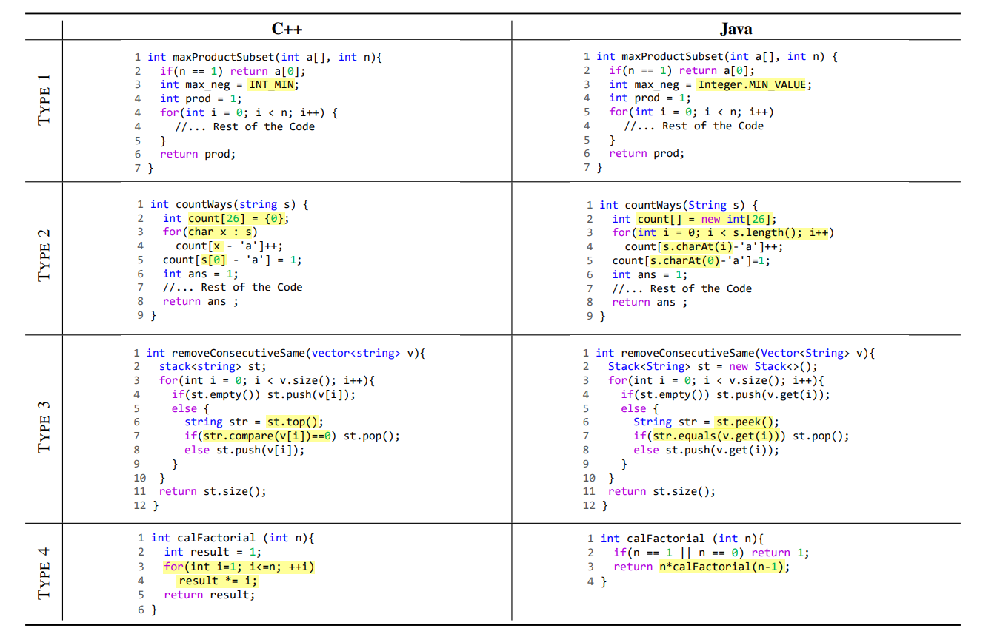

# G-TransEval
This is the github page of paper "On the Evaluation of Neural Code Translation: Taxonomy and Benchmark". The folder contents are as follows:
- [BenchmarkResults](BenchmarkResults): Models' translation results on G-TransEval
- [Datasets](Datasets): Other datasets used in our paper
- [Empirical Study](Empirical%20Study): Emperical Study resources
- [G-TransEval](G-TransEval): Our released G-TransEval dataset
- [TestRunner](TestRunner): An automatic unit test tool for G-TransEval

## Taxonomy Example
We develop a taxonomy that categorizes code translation tasks into four primary types according to their complexity and knowledge dependence: 
- Token Level (Type 1)
- Syntactic Level (Type 2)
- Library Level (Type 3)
- Algorithm Level (Type 4)

The following image shows examples of four types of translation.

## Baselines
|Models          |Source                                        |
|----------------|----------------------------------------------|
|CodeBERT        |https://huggingface.co/microsoft/codebert-base|
|CodeT5          |https://huggingface.co/Salesforce/codet5-base |
|TransCoder      |https://github.com/facebookresearch/CodeGen   |
|TransCoder-ST   |https://github.com/facebookresearch/CodeGen   |

## G-TransEval
G-TransEval is the first categorized test set designed to provide fine-grained and extensive evaluations of code translation models. Our benchmark leverages existing benchmarks and extends them to involve all four translation types. To increase the reliability of performance measures, Each test sample are augmented with unit test cases.

G-TransEval comprises a total of 400 code translation pairs between 5 language pairs, i.e., Python, C++, Java, C#, and JavaScript. The first three types consis of 125 translation pairs each, and the fourth type compries 25 translation pairs. Our dataset are available at [G-TransEval](/G-TransEval). The folder structure are as follows:

- all: The test data across all four types
- l1: Type 1 
- l2: Type 2
- l3: Type 3
- l4: Type 4

## Model Evaluation Results on G-TransEval
The translation generated by CodeT5, TransCoder and TransCoder-ST together with their results of unit tests are placed in the `BenchmarkResults` folder.
Here are the full experiment results of CodeT5, TransCoder and TransCoder-ST evaluated on G-TransEval

### CodeT5

| Model: CodeT5 | Target         | C++   |      |       |      | C#    |      |       |      | Java  |      |       |      | JS    |      |       |      | Python |      |       |      |
|--------|----------------|-------|------|-------|------|-------|------|-------|------|-------|------|-------|------|-------|------|-------|------|--------|------|-------|------|
| Source | Type \ Metrics | BLEU  | EM   | CB    | CA   | BLEU  | EM   | CB    | CA   | BLEU  | EM   | CB    | CA   | BLEU  | EM   | CB    | CA   | BLEU   | EM   | CB    | CA   |
| C++    | Type 1         | /     |      |       |      | 97.98 | 81.6 | 97.71 | 93.6 | 97.39 | 85.6 | 97.35 | 94.4 | 86.6  | 13.6 | 86.75 | 91.2 | 82.08  | 12   | 82.77 | 88   |
|        | Type 2         |       |      |       |      | 87.4  | 38.4 | 85.64 | 73.6 | 82.15 | 24   | 81.28 | 83.2 | 80.8  | 8.8  | 80.41 | 74.4 | 79.59  | 8.8  | 79.67 | 75.2 |
|        | Type 3         |       |      |       |      | 80.91 | 18.4 | 78.83 | 51.2 | 74.52 | 6.4  | 74.26 | 58.4 | 73.78 | 4    | 74.57 | 51.2 | 79.13  | 6.4  | 80.21 | 68.8 |
|        | Type 4         |       |      |       |      | 33.42 | 0    | 44.72 | 0    | 33.8  | 0    | 45.19 | 0    | 32.82 | 0    | 39.49 | 0    | 35.51  | 0    | 39    | 4    |
| C#     | Type 1         | 96.4  | 62.4 | 96.57 | 97.6 | /     |      |       |      | 98.59 | 84   | 98.77 | 97.6 | 85.44 | 12.8 | 86.31 | 90.4 | 82.34  | 10.4 | 83.41 | 91.2 |
|        | Type 2         | 91.79 | 46.4 | 92.21 | 72   |       |      |       |      | 94.75 | 47.2 | 92.94 | 75.2 | 80.96 | 7.2  | 81.22 | 68.8 | 80.01  | 8.8  | 79.85 | 66.4 |
|        | Type 3         | 83.23 | 20   | 84.26 | 54.4 |       |      |       |      | 87.48 | 13.6 | 85.34 | 56.8 | 77.07 | 4    | 76.92 | 41.6 | 79.36  | 6.4  | 80.35 | 63.2 |
|        | Type 4         | 32.62 | 0    | 41.84 | 0    |       |      |       |      | 55.8  | 0    | 58.5  | 0    | 44.28 | 0    | 45.44 | 4    | 39.11  | 0    | 41.35 | 0    |
| Java   | Type 1         | 94.14 | 52   | 94.41 | 90.4 | 98.38 | 78.4 | 98.4  | 92.8 | /     |      |       |      | 84.67 | 12   | 85.25 | 85.6 | 82.71  | 11.2 | 83.07 | 88   |
|        | Type 2         | 91.33 | 37.6 | 91.47 | 72.8 | 93.58 | 61.6 | 92.24 | 77.6 |       |      |       |      | 82.74 | 8.8  | 82.06 | 73.6 | 78.9   | 8.8  | 79.11 | 74.4 |
|        | Type 3         | 83.66 | 16   | 84.67 | 48   | 85.62 | 26.4 | 83.79 | 66.4 |       |      |       |      | 75.18 | 4    | 75.71 | 52.8 | 78.62  | 9.6  | 78.95 | 68   |
|        | Type 4         | 31.76 | 0    | 40.87 | 0    | 58.86 | 0    | 54.11 | 0    |       |      |       |      | 31.76 | 0    | 40.87 | 0    | 58.86  | 0    | 54.11 | 0    |
| JS     | Type 1         | 94.17 | 52   | 94.6  | 88.8 | 94.5  | 56   | 94.61 | 80   | 93.46 | 60.8 | 93.81 | 76.8 | /     |      |       |      | 82.31  | 10.4 | 83.23 | 88.8 |
|        | Type 2         | 86.77 | 23.2 | 88    | 51.2 | 84.38 | 22.4 | 82.05 | 52.8 | 80.35 | 15.2 | 78.07 | 62.4 |       |      |       |      | 80.71  | 13.6 | 81.54 | 74.4 |
|        | Type 3         | 79.19 | 11.2 | 80.78 | 28.8 | 80.23 | 9.6  | 77.66 | 45.6 | 74.26 | 1.6  | 72.04 | 37.6 |       |      |       |      | 79.42  | 6.4  | 80.59 | 67.2 |
|        | Type 4         | 32.53 | 0    | 40.3  | 0    | 34.27 | 0    | 36.95 | 0    | 29.71 | 0    | 36.61 | 0    |       |      |       |      | 40.64  | 0    | 41.42 | 0    |
| Python | Type 1         | 83.13 | 8    | 84.17 | 78.4 | 83.23 | 11.2 | 84.64 | 75.2 | 81.98 | 9.6  | 84.81 | 78.4 | 72.06 | 2.4  | 74.55 | 69.6 | /      |      |       |      |
|        | Type 2         | 78.99 | 8    | 80.51 | 43.2 | 77.07 | 7.2  | 76.23 | 48   | 69.57 | 4    | 68.91 | 50.4 | 72.78 | 6.4  | 73.9  | 64.8 |        |      |       |      |
|        | Type 3         | 70.63 | 0.8  | 73.08 | 20   | 71.96 | 3.2  | 71.62 | 40   | 67.47 | 1.6  | 67.61 | 44.8 | 70.33 | 2.4  | 71.9  | 47.2 |        |      |       |      |
|        | Type 4         | 25.45 | 0    | 35.73 | 0    | 26.51 | 0    | 31.8  | 0    | 21.79 | 0    | 28.13 | 0    | 31.66 | 0    | 34.77 | 8    |        |      |       |      |

### TransCoder

| Model: TransCoder | Target          | C++   |      |       |      | Java  |      |       |      | Python |      |       |      |
|------------|-----------------|-------|------|-------|------|-------|------|-------|------|--------|------|-------|------|
| Source     | Type \ Metrics | BLEU  | EM   | CB    | CA   | BLEU  | EM   | CB    | CA   | BLEU   | EM   | CB    | CA   |
| C++        | Type 1          | /     |      |       |      | 93.55 | 52.8 | 94.22 | 92.8 | 86.49  | 28.8 | 83.65 | 56   |
|            | Type 2          |       |      |       |      | 69.5  | 4.8  | 68.77 | 57.6 | 86.04  | 36.8 | 85.22 | 59.2 |
|            | Type 3          |       |      |       |      | 68.86 | 1.6  | 66.27 | 33.6 | 76.01  | 6.4  | 75.89 | 19.2 |
|            | Type 4          |       |      |       |      | 31.75 | 0    | 48.37 | 0    | 37.69  | 0    | 44.69 | 0    |
| Java       | Type 1          | 89.73 | 27.2 | 90.61 | 94.4 | /     |      |       |      | 86.28  | 28.8 | 83.73 | 57.6 |
|            | Type 2          | 83.76 | 7.2  | 84.95 | 69.6 |       |      |       |      | 84.39  | 31.2 | 84.37 | 60.8 |
|            | Type 3          | 74.83 | 4    | 78.02 | 38.4 |       |      |       |      | 78.04  | 8    | 77.71 | 26.4 |
|            | Type 4          | 19.91 | 0    | 30.09 | 0    |       |      |       |      | 37.71  | 0    | 39.35 | 0    |
| Python     | Type 1          | 81.21 | 10.4 | 83.24 | 78.4 | 82.82 | 17.6 | 85.32 | 78.4 | /      |      |       |      |
|            | Type 2          | 73.54 | 6.4  | 76.94 | 45.6 | 65.13 | 1.6  | 65.18 | 46.4 |        |      |       |      |
|            | Type 3          | 64.18 | 2.4  | 68.79 | 12   | 65    | 1.6  | 63.76 | 19.2 |        |      |       |      |
|            | Type 4          | 23.51 | 0    | 31.64 | 0    | 25.99 | 0    | 34.39 | 0    |        |      |       |      |

### TransCoder-ST 

The official checkpoints of TransCoder-ST have problems with Python-to-C++ translation, leading to lower scores. 

| Model: TransCoder-ST | Target          | C++   |      |       |      | Java  |      |       |      | Python |      |       |      |
|---------------|-----------------|-------|------|-------|------|-------|------|-------|------|--------|------|-------|------|
| Source        | Type \ Metrics | BLEU  | EM   | CB    | CA   | BLEU  | EM   | CB    | CA   | BLEU   | EM   | CB    | CA   |
| C++           | Type 1          | /     |      |       |      | 94.5  | 53.6 | 95.15 | 95.2 | 90.83  | 47.2 | 89.6  | 84   |
|               | Type 2          |       |      |       |      | 70.11 | 5.6  | 69.55 | 55.2 | 87.06  | 41.6 | 87.47 | 71.2 |
|               | Type 3          |       |      |       |      | 68.45 | 3.2  | 67.69 | 36.8 | 80.94  | 11.2 | 80.37 | 34.4 |
|               | Type 4          |       |      |       |      | 33.38 | 0    | 43.06 | 0    | 39.49  | 0    | 45.87 | 0    |
| Java          | Type 1          | 87.95 | 18.4 | 88.78 | 97.6 | /     |      |       |      | 90.12  | 43.2 | 88.66 | 80.8 |
|               | Type 2          | 83.93 | 4.8  | 84.85 | 71.2 |       |      |       |      | 87.38  | 36   | 87.6  | 76   |
|               | Type 3          | 76.2  | 3.2  | 79.26 | 40.8 |       |      |       |      | 84.42  | 20.8 | 84.15 | 69.6 |
|               | Type 4          | 24.96 | 0    | 34.78 | 4    |       |      |       |      | 50.99  | 4    | 49.5  | 4    |
| Python        | Type 1          | 66.92 | 5.6  | 80.71 | 78.4 | 90.86 | 38.4 | 91.94 | 88   | /      |      |       |      |
|               | Type 2          | 54.83 | 0    | 67.02 | 18.4 | 66.11 | 4.8  | 64.82 | 51.2 |        |      |       |      |
|               | Type 3          | 55.4  | 0    | 66.33 | 14.4 | 70.84 | 5.6  | 69.14 | 38.4 |        |      |       |      |
|               | Type 4          | 14.57 | 0    | 27.32 | 0    | 24.36 | 0    | 29.51 | 0    |        |      |       |      |

## Unit Test Runner
The automatic unit test tool is placed in the `TestRunner` folder. See [detailed instruction](TestRunner/README.md) for usages. 

