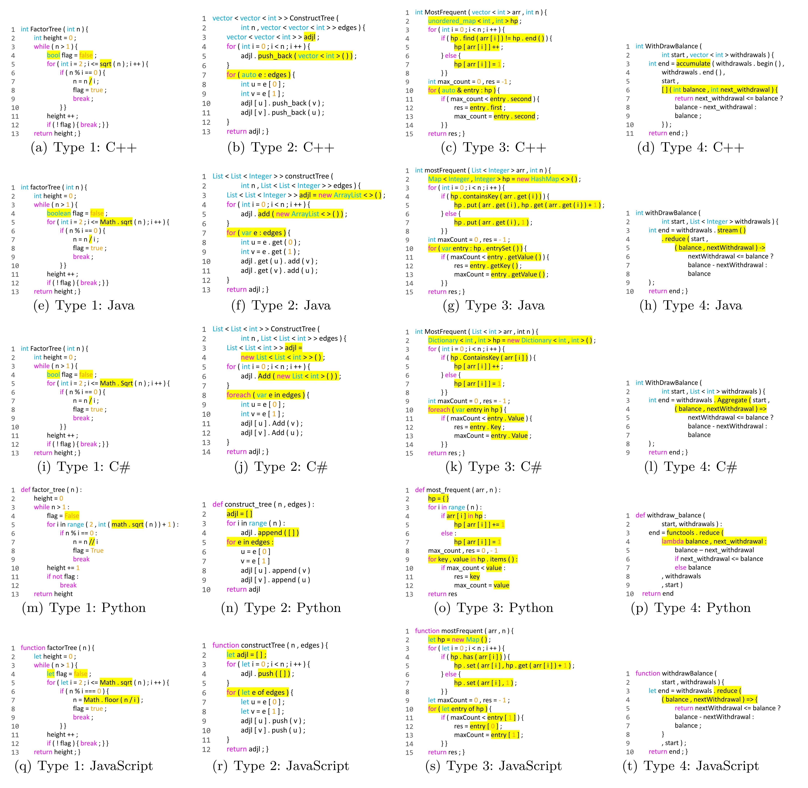

# Taxonomy
We develop a taxonomy that categorizes code translation tasks into four primary types according to their complexity and knowledge dependence: 
- Token Level (Type 1): Map trivial tokens to their equivalent in the target
- Syntactic Level (Type 2): Migrate syntactic structures based on linguistic rules
- Library Level (Type 3): Migrate library to their equivalent in the target language
- Algorithm Level (Type 4): Reimplement the program in the target language using a different algorithm

The following image shows examples of four types of translation.

